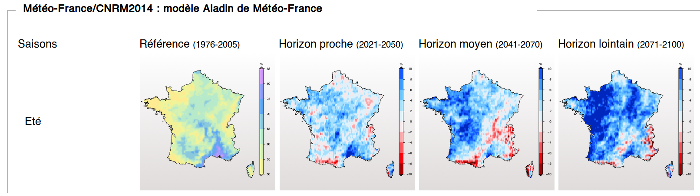
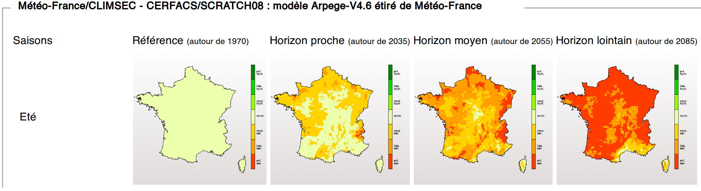
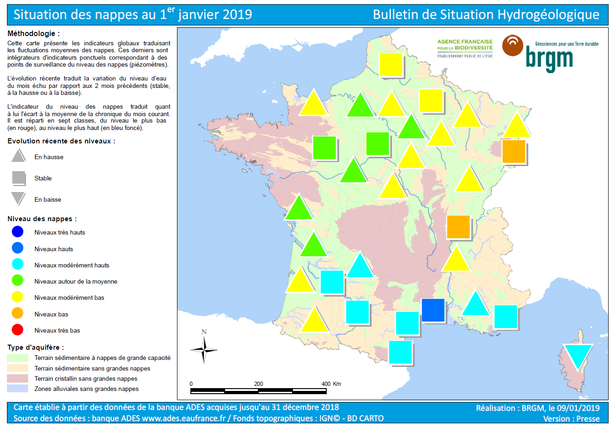

# Données liées aux estimations climatiques pour la métropole & les outre-mer

> Les principaux jeux de données brutes que nous utilisons sont ceux du *Groupe d'experts intergouvernemental sur l'évolution du climat (GIEC)*. Une des manières les plus simples d'exploiter leurs données est d'utiliser le visualiseur [*Drias*](http://drias-climat.fr/). 

Représenter les prévisions  des évolutions de températures jusqu'aux environ 2070 - *métropole & outre-mer*
---

* prévisions  basées sur les données du *Groupe d'experts intergouvernemental sur l'évolution du climat (GIEC) 2014*
* si vous souhaitez suivre les évolutions depuis 2014 jusqu'à aujourd'hui se rendre sur [ClimatHD](http://www.meteofrance.fr/climat-passe-et-futur/climathd) > *démarrer* > *températures* 

Le visualiseur avancé ([cliquez ici](http://drias-climat.fr/decouverte/carte/experience?region=SAFRAN&generation=rcp)) va vous permettre de représenter différents critères. Comme ci dessous la moyenne du nombre de journées d'été (journées avec des températures supérieures à 25°C), par an, à différents horizons temporels. 

*Drias, données Météo-France, CERFACS, IPSL* / *Scénario sans politique climatique 8,5 / [Crédits et conditions d'utilisation](http://www.drias-climat.fr/accompagnement/conditions)*

**Vous avez la possibilité de représenter les prévisions des données suivantes sur plusieurs horizons par mois, saisons, années**
* Température moyenne - °C 
* Température minimale - °C
* Température maximale - °C
* Amplitude thermique - °C 
* Extrême chaud de la température minimale (90ème centile de la température minimale) - °C
* Extrême chaud de la température maximale (90ème centile de la température maximale) - °C
* Nombre de journées d'été (température maximale > 25°C) - NBJ 
* Nombre de nuits tropicales (température minimale > 20°C) - NBJ 
* Nombre de jours anormalement chauds (température maximale supérieure de plus de 5°C à la normale) - NBJ
* Nombre de nuits anormalement chaudes (température minimale supérieure de plus de 5°C à la normale) - NBJ 
* Nombre de jours de vague de chaleur (température maximale supérieure de plus de 5°C à la normale pendant au moins 5 jours consécutifs) - NBJ 
* Extrême froid de la température minimale (10ème centile de la température minimale) - °C 
* Extrême froid de la température maximale (10ème centile de la température maximale) - °C 
* Nombre de jours de gel (température minimale <= 0°C) - NBJ 
* Nombre de jours sans dégel (température maximale <= 0°C) - NBJ 
* Nombre de jours anormalement froids (température minimale inférieure de plus de 5°C à la normale) - NBJ 
* Nombre de jours de vague de froid (température minimale inférieure de plus de 5°C à la normale pendant au moins 5 jours consécutifs) - NBJ

> Note: nous vous proposons de ne pas utiliser les données faisant référence *"à la normale"* (comme les écarts de températures par rapport *à la normale*). 

Représenter les estimations des évolutions des précipitations jusqu'aux environ 2070 - *métropole & outre-mer*
---

* prévisions basées sur les données du *Groupe d'experts intergouvernemental sur l'évolution du climat (GIEC) 2014*
* si vous souhaitez suivre les évolutions depuis 2014 jusqu'à aujourd'hui se rendre sur [ClimatHD](http://www.meteofrance.fr/climat-passe-et-futur/climathd) > *démarrer* > *précipitations* 

Le visualiseur avancé ([cliquez ici](http://drias-climat.fr/decouverte/carte/experience?region=SAFRAN&generation=rcp)) va vous permettre de représenter différents critères comme le *les anomalies de précipitations intenses en été* sur plusieurs horizons. Ce qui donne par exemple ceci: 

*Drias, données Météo-France, CERFACS, IPSL* / *Scénario sans politique climatique 8,5* / [Crédits et conditions d'utilisation](http://www.drias-climat.fr/accompagnement/conditions)

> La carte ci dessus n'est pas évidente à lire mais nous donne des renseignements précieux. Dans l'horizon de référence (disons qu'il s'agissait de l'an 1990) on voit qu'il y a déjà dans le *sud de la métropole* des *précipitations intenses supérieures entre 80 et 85%* (en violet). Cala signifie que 80 à 85% des pluies y sont intenses. Dans l'horizon proche déjà on voit ce nombre de précipitations intenses augmenter avec une estimation de +10%. Autrement dit 90-95% des précipitations qui sont intenses. Pour la Bretagne où il pleut beaucoup en terme de *cumul* mais de manière régulière on part dans l'horizon de référence avec moins de 55% de précipitations intenses. Lorsqu'on regarde les anomalies il faut à chaque fois regarder d'où on part et comment ça évolue.

**Vous avez la possibilité de représenter les estimations des données suivantes sur plusieurs horizons par mois, saisons, années**

* Précipitations quotidiennes - mm
* Précipitations moyennes les jours pluvieux - mm 
* Cumul de précipitations - mm 
* Nombre de jours de pluie (cumul de précipitations >= 1 mm) - NBJ
* Nombre de jours de fortes précipitations (cumul de précipitations >= 20 mm) - NBJ
* Nombre maximum de jours de pluie consécutifs (maximum de jours consécutifs avec cumul de précipitations >= 1 mm) - NBJ 
* Pourcentage des précipitations intenses (précipitations au-dessus du 90ème centile annuel) - % 
* Période de sècheresse (maximum de jours consécutifs avec cumul de précipitations inférieures à 1mm)

Représenter les estimations de la sécheresse des sols jusqu'aux environ 2070 - *métropole*
---

* basées sur les données du *Groupe d'experts intergouvernemental sur l'évolution du climat (GIEC) 2007* et du laboratoire public *Climsec*
* [voici une explication pour comprendre les mesures de sécheresse de l'humidité des sols](https://www.umr-cnrm.fr/spip.php?article605)

**Visualiser les données de la sécheresse des sols**

Le visualiseur du *Climsec-Drias* ([cliquez ici](http://drias-climat.fr/decouverte/carte/climsec/experience)) va vous permettre de représenter l'évolution de la sécheresse des sols nommée *Indicateur sècheresse d'humidité des sols (SSWI)*. Ce qui donne ceci pour avec le *scénario pessimiste* pour les *étés*:

*Sécheresse des sols en été* / *Climsec* / *Scénario dit "pessimiste A2"* / [Crédits et conditions d'utilisation](http://www.drias-climat.fr/accompagnement/conditions)

> Plus la couleur vire vers le rouge plus les sols seront *très secs* par rapport à en 1970. Si dans le *sud* de la métropole une partie de la zone reste en jaune dont en critère *normal* c'est il n'y a pas d'évolution de la sécheresse des sols. Ces sols étaient déjà considérés comme *très secs* en 1970. Un sol "très sec" ne veut pas non plus dire qu'il n'y a plus d'eau dans le sous-sol de la zone. On parle ici de sécheresse des sols de surface.

**Comprendre combien de temps vont durer les périodes sèches à l'avenir**

Se rendre sur [ClimatHD](http://www.meteofrance.fr/climat-passe-et-futur/climathd) > *démarrer* > *impacts* > *humidité des sols* et se faire guider par le graphique dynamique. Si vous cliquez sur *En savoir plus* cela vous permet de télécharger une analyse plus poussée. 

Représenter les estimations des risques de possibilité de feux de forêt - *métropole*
---

* prévisions basées sur les données du *Groupe d'experts intergouvernemental sur l'évolution du climat (GIEC) 2007* et du laboratoire public *Climsec*
* [voici une explication pour comprendre comment l'indice de risque est défini - par météo limoux](http://meteolimoux.fr/meteo%20feux%20de%20for%C3%AAt/index.html)

*Risques de possibilité de feux de forêt en été* / *Climsec* / *Scénario dit "pessimiste A2"* / [Crédits et conditions d'utilisation](http://www.drias-climat.fr/accompagnement/conditions)

# Données liées au sous-sol et eaux sous-terraines (nappes phréatiques, zones imperméables, ...) métropole & les outre-mer

Découvrir le niveau des nappes phréatiques & leur localisation: pour commencer
---
Pour savoir où en sont les nappes phréatiques mois par mois consulter les [cartographies du BRGM](https://www.brgm.fr/presse/liste-publications-presse?typepresse%5B0%5D=17&activites%5B0%5D=24).

**Voici un exemple**

[État nappes 1er janvier 2019, BRGM](https://www.brgm.fr/publication-presse/etat-nappes-eau-souterraine-1er-janvier-2019) 

Localisation et nature des nappes phréatiques: pour aller plus loin
---

Accéder au [visualiseur des *entités hydrogéologiques de métropole*](https://bdlisa.eaufrance.fr/carte) conçu par les acteurs publics de l'eau en France. Pour les outre-mer vous avez possibilité de télécharger les données brutes sur [data.gouv.fr](https://www.data.gouv.fr/fr/search/?q=bdlisa)

* la couche *Entités hydrogéologiques affleurantes par nature* qui représente la *présence potentielle où non d'eau dans la roche*. Attention ça peut être contre-intuitif. Dans le *Doubs* c'est un grand massif calcaire ("secteur karstique") qui est en bleu puisqu'il y a potentiellement de l'eau et ça ne les a pas empêché de subir un ravitaillement en eau potable pour *35 communes*. 
* la couche *Entités hydrogéologiques affleurantes par thème*. Les zones en *rouge* dites "socle" sont des zones où il y a peu de nappes phréatiques
* la couche *Entités hydrogéologiques affleurantes par milieu* est précieuse car en fonction de si la roche est *poreuse* *fissurée* ou *karstique* (donc calcaire) l'eau ne se comportera pas de la même manière.
* la couche *Entités ou secteurs karstiques* représente les *zones calcaires*. Les grandes zones en *bleu clair* dites *affleurantes* sont des grandes zones calcaires aves des sources, des cascades.

