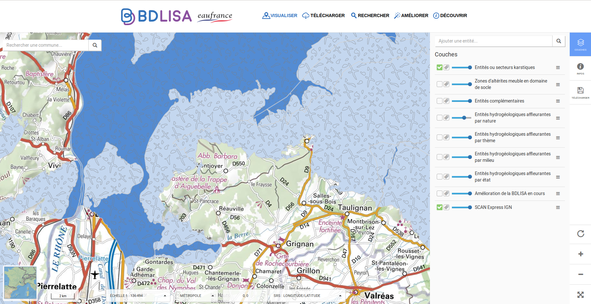

Voici comment repérer si votre municipalité répond au critère suivant :
> La municipalité est localisée sur une zone de relief calcaire + n'est pas située sur une grande réserve d'eau sous-terraine.

Les zones de relief sont celles où l'eau est la plus susceptible de "fuir" dans les rigoles formées par le calcaire(=karst).  
Les grands ensemble sous-couche sont des vastes lieux naturels sous-terrains permettant le stockage de l'eau. 

**Localiser une zone de relief calcaire**:

Les grands ensembles calcaires à relief sont **en violet** ci dessous.  

En hydrogéologie elles sont nommées: "[formations karstiques plissées](http://www.rhone-mediterranee.eaufrance.fr/milieux-aquatiques/eaux-souterraines/formations-geologiques/calcaires.php)". 

**Localiser un grand ensemble calcaire sous couche**

Une fois qu'une zone en violet est localisée allez voir de plus près grâce au [visualisateur des acteurs de l'eau en France, BDLisa](http://bdlisa.eaufrance.fr) : 

1. Cliquez sur "l'espace cartographique".  
Cochez la case "entités ou secteurs karstiques"

*Source: BDlisa*

2. Repérez la zone qui attire votre attention et zoomez. Vous pouvez observer deux couleurs : bleu clair et bleu foncé. 

> Les  *zones en bleu clair*  sont des couches de *calcaire affleurant*(proches de la surface).  
Les *zones en bleu foncé* sont des couches de *calcaire en profondeur*. 

Les zones en bleu foncé présentent souvent des réserves d'eau de grande quantité, comme des cuvettes. Les roches peuvent sous certaines conditions être saturées d'eau. S'il s'agit d'une zone de plusieurs dizaines de kilomètres il y a des chances qu'il y ait des réserves d'eau.

3. L'exploration continue avec les zones en bleu clair ou les zones en bleu foncé de quelques kilomètres carré.

> Les zones bleu clair ont souvent moins de possibilité de stockage. Pour les petites zones bleu foncées, la question est à étudier. 

Pour comprendre le comportement de l'eau sur les zones karstiques, lire [les notes de la formation hydrogéologie](../hydrogeologie-penuries-explorations)

**Ouf: je ne rentre pas dans ces critères mais je suis tout de même sur une de ces zones en violet!**

Si vous habitez sur une des zones violettes (voir carte ci dessus) il se peut que votre commune soit invitée à faire preuve de "solidarité territoriale" même si elle ne rencontre pas de problématique lié à l'eau potable. L'eau a toujours été l'or bleu sur ces zones et si une formation géologique particulière garanti à votre ville/village une réserve d'eau c'est génial et il s'agit donc d'en prendre soin.
