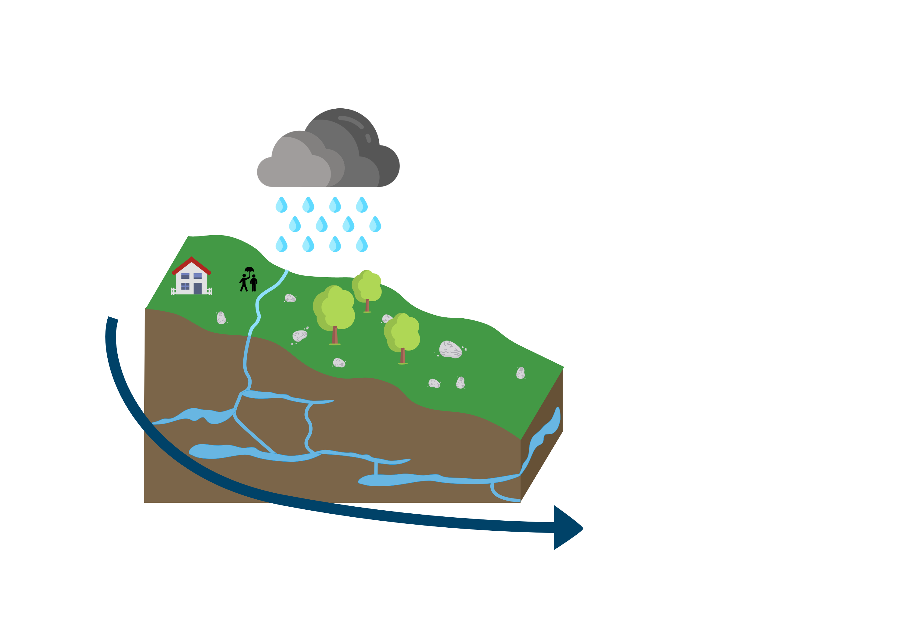
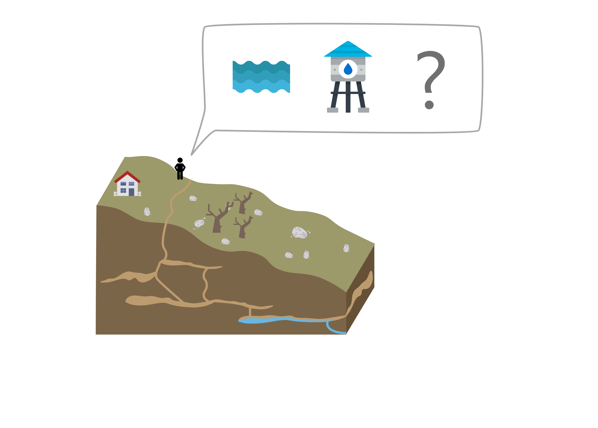

# Des pénuries ? 

##  ⛰️ Dans le Doubs 

  

> Massif du Jura, département du Doubs, automne 2018 : les municipalités en rouge ont été ravitaillées par camion citerne, celles en orange ont réussi à se brancher sur des réserves d'autres municipalités, les jaunes sont en tension.  
*Source: Préfecture du Doubs*  

## ... Et ailleurs

La situation est critique pour d'autres municipalités dans les Alpes, Languedoc, ...   

**Pourquoi ?** Ces municipalités puisent l'eau potable sous-terre. Cependant, l'eau n'y est pas retenue longtemps, car sont des zones de **relief** à roches **calcaire**.  

Voici le phénomène en image : 

 Image | Explication
------------ | -------------
 | L'eau de pluie s'infiltre rapidement dans le sous-sol.  
 | Lors de sécheresses, l'eau s'évacue vers les plaines. Jusqu'à 30 mètres par jour ! 
 | Il faut utiliser d'autres sources d'eau (Châteaux d'eau ? Aides de communes voisines, nouveaux forages ..? )

## A l'avenir ? 

Il est prévu une hausse des températures moyennes d'environ 2° d'ici 30 ans, et la fiabilité est bonne.  

Quel impact de la hausse des températures ? 
* 🌩Phénomènes orageux : la pluie tombe "d'un coup". Les périodes sans pluie sont plus longues, et au total, moins d'eau s'infiltre dans le sol.
* 🌫 Evaporation
* 🥛 Augmentation du besoin en eau des plantes : Lorsque l'air est trop sec, les plantes utilisent plus d'eau au sol (de nombreux arbres peuvent boire 300L d'eau par jour !)

La hausse des températures peut amener une **réduction des stocks d'eau sous-terrains**.  

> Dès que le sol et la flore sont impactés par le manque d'eau, on parle de [sécheresse](https://www.futura-sciences.com/planete/definitions/meteorologie-secheresse-6527/). Si les réserves d'eau sous-terraines se réduisent, on parle de sécheresse *hydrologique* . 

> Sources : GIEC, météofrance... ( à préciser )

# Evaluer le risque

Vous pouvez évaluer le risque de pénurie d'eau potable dans votre commune (ou ailleurs) : 

OU | QUAND | COMMENT
 ------------ | ------------- | -------------
[Où résidez-vous ? Y a t-il des grandes réserves d'eau ?](../eau-geologie-karstique) | [Quand sont prévues des sécheresses ? Quelle sera leur durée et leur intensité ?](../indice-sswi) | Comment votre commune est alimentée en eau actuellement, est-ce des sources durables et suffisantes pour votre utilisation ? (à venir)
